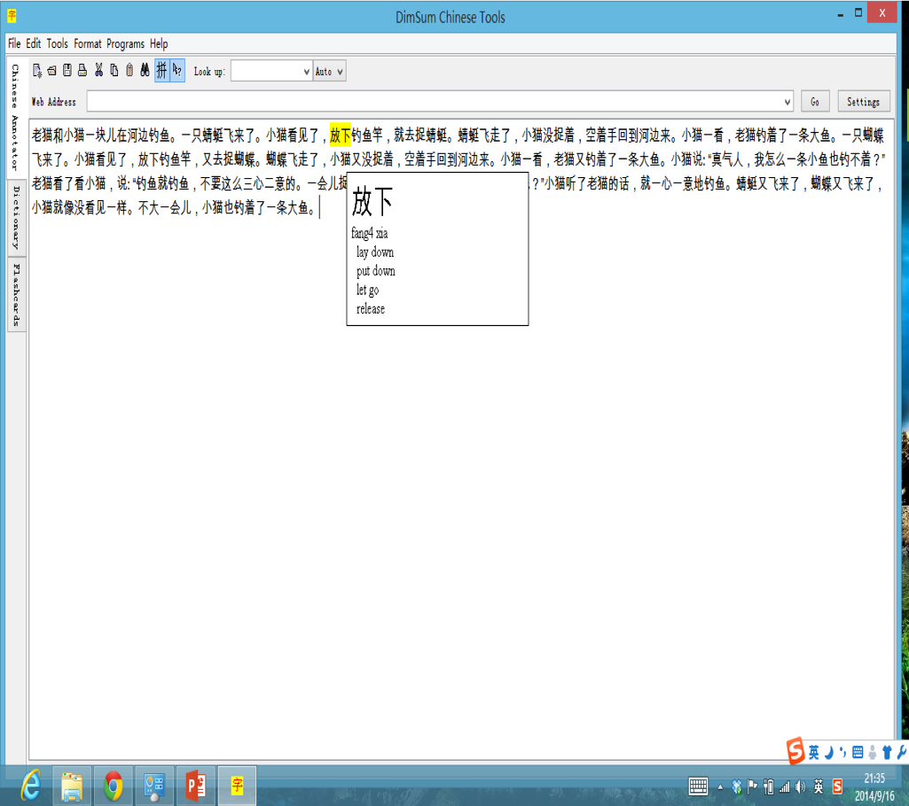
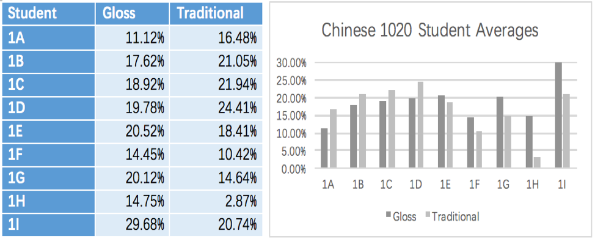
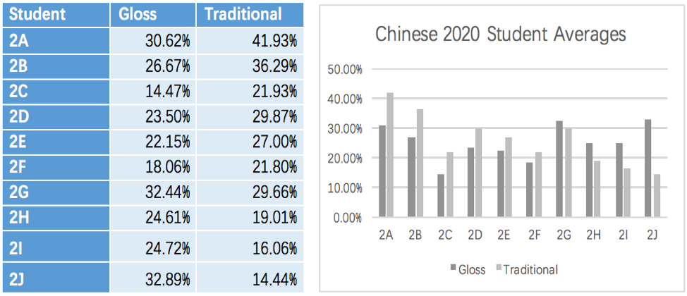

<!-- Global site tag (gtag.js) - Google Analytics -->
<script async src="https://www.googletagmanager.com/gtag/js?id=UA-116712862-1"></script>
<script>
  window.dataLayer = window.dataLayer || [];
  function gtag(){dataLayer.push(arguments);}
  gtag('js', new Date());

  gtag('config', 'UA-116712862-1');
</script>


</br>
```{r, fig.align='center',out.width = "600px",out.height="400px", echo=FALSE}
knitr::include_graphics("images/iconFred2.png")
```

<hr>
<hr>
# L2 Research Projects
## Gaming in the Chinese Dual Language Immersion Classroom

</br>
Utah is one of the first states in the U.S. to offer a statewide dual language immersion (DLI) program in public schools. Currently nearly 200 schools offer one of 5 languages (German, Spanish, Portuguese, French, and Chinese). In these programs students spend half of the day learning in English and the other half in the target language. From first to third grade DLI students learn math in the target language and then in fourth to sixth grade they begin learning science and social studies in the target language. 
</br></br>
One issue, particularly with Chinese DLI students (given the difficulty of the text) is developing both literacy skills and content simultaneously. Learners need more instructional time to learn the Chinese text than students of other DLI languages. However, given the time constraints that DLI programs face, finding the extra time is difficult. One solution is to use games to both improve Chinese literacy skills and subject (e.g. math, science) knowledge. In my research I have developed and tested two games in Chinese DLI classrooms and I am currently working on a mod to create support within a commercial-off-the-shelf game as well as provide methods for tracking students in-game play and behavior as a means to assess learning. Below I provide a brief description of past projects and will update this site as new projects arise. 

### DLI Board Game -- *神秘森林 (Mystery Forest)*

</br>
```{r, fig.align='center',out.width = "400px",out.height="200px",fig.cap="Board Game Cover", echo=FALSE}
knitr::include_graphics("images/mfBoard.png")
```
This board game was designed for second grade Chinese dual language immersion students to help improve both Chinese vocabulary/characater recognition and math skills (addition and subtraction). Up to 8 players can play on one board  (see below). Each players starts at one of the corner pieces and then rolls one dice to determine how spaces they can move. 
</br></br>
```{r, fig.align='center',out.width = "400px",out.height="200px",fig.cap="Board", echo=FALSE}
knitr::include_graphics("images/board.png")
```
Spread throughout the outer circle of the game, on the tiles, are randomly placed black markers. Each of the black markers represent a baddie (see below). Each of the baddies have a power score (represented by a lightning bolt) and a health score (represented by a heart symbol). Players can choose to fight the baddies by moving their pieces on to a tile with a black marker. Battles completed by rolling dice. The power score dictates the number of dice to use and the total number rolled on the dice is the amount subtracted from the health score. After a player attacks the baddie attacks. The game is designed so that players will struggle to bring down a baddie on their own. Players must use Chinese and Math skills to discuss strategies for taking on baddies. 
</br></br>
```{r, fig.align='center',out.width = "400px",out.height="200px",fig.cap="Baddies", echo=FALSE}
knitr::include_graphics("images/baddies.png")
```
Once a baddie is defeated, players are able to draw a set number of items (depending on the baddie) from the Items deck. Items (see below) can be added to a player's character to increase their own health score and power score.
```{r, fig.align='center',out.width = "400px",out.height="200px",fig.cap="Items", echo=FALSE}
knitr::include_graphics("images/items.png")
```
To keep track of items and player scores, players can use the character sheet (see below).
```{r, fig.align='center',out.width = "400px",out.height="200px",fig.cap="Items", echo=FALSE}
knitr::include_graphics("images/charactersheet.png")
```
The game ends once players have defeated all baddies on the board. However, the game can continue on by adding more baddies each during each subsequent session. 

#### Findings 
This study was not published as I am currently working on revising the game. In the initial round some groups played the game successfully and engaged in meaningful addition/subtraction in the target language, however other groups struggled with using the character sheet and the many pieces on the board ended up being a distraction. At the moment I am working on turning it into a card game which will eliminate many of the distractions and allow learners to spend more time on the collaborative and educational aspects of the game. 

### Interactive Fiction Game -- *Adventure Chinese*

Following the board game I developed an HTML based interactive fiction game using the open source tool <a href="twinery.org">Twine</a>. In the game players are sent on an adventure to stop a villian from world domination by collecting three keys in the wilderness and opening a chest to retreive a magic seed.
</br></br>
In the game players start in their home where they can collect items that may or may not be useful on their adventure. One of the items they can collect is a notebook which allows them to look up vocabulary words as they read their stories. However, they can only have ten words in their notebook at one time, so they will be constantly pushed to evauluate their current understanding of the vocabulary in their notebook.
```{r, fig.align='center',out.width = "400px",out.height="200px",fig.cap="Items", echo=FALSE}
knitr::include_graphics("images/sdgHome.png")
```
As players travel into the wilderness they come upon animals, people and other things in nature. Depending on the choices they make in each scenario their chances of finding one of the keys increasess or decreases.
```{r, fig.align='center',out.width = "400px",out.height="200px",fig.cap="Items", echo=FALSE}
knitr::include_graphics("images/sdgMount.png")
```
Once all three keys have been found the game is complete. The article below has more details concerning the findings in this project. 

**Poole, F.**, Franco, J., & Clarke-Midura, J. Developing a personalized, educational gaming experience for young Chinese DLI learners: A design-based approach. In R. Zheng (Ed.), *Digital Technologies and Instructional Design for Personalized Learning* (pp. 253-274). IGI Global

</br>
</br>
Click the link below to try the game. *For best results open the game using FireFox Web Browser*
</br>
</br>
<a href="http://itlstest.usu.edu/">Adventure Chinese Game</a>
</br>
</br>

## Reading in Digital, Collaborative Environments
In the last few years I have collaborated with <a href="https://lpcs.usu.edu/directory/faculty/thoms-joshua">Dr. Joshua Thoms</a> and <a href="https://lpcs.usu.edu/directory/faculty/sung-ko-yin">Dr. Ko-Yin Sung</a>, to explore the affordances and pedagogical implications of reading in a digital, collaborative environment. 

In our first project we used eComma in a first-year Chinese course. See the article below for more information. 
</br>
2017 --	Thoms, J., Sung, K. Y., & **Poole, F.** Investigating the linguistic and pedagogical affordances of an L2 open reading environment via eComma: An exploratory study in a Chinese language course.
</br>
</br>
```{r, fig.align='center',out.width = "400px",out.height="200px",fig.cap="eComma Environment", echo=FALSE}
knitr::include_graphics("images/eComma.png")
```
</br>
</br>
Dr. Joshua Thoms and I have conducted some additional studies using the Hylighter Environment with an Advanced Spanish Poetry class. See the articles below for more information. 
</br>
</br>
Forthcoming -- Thoms, J., & **Poole, F.** Exploring digital literacy practices via L2 social reading, *L2 Journal* (Special Issue).
</br>
</br>
Thoms, J., & **Poole, F.** Investigating linguistic, literary, and social affordances of L2 collaborative reading. *Language Learning & Technology*, 21(2), 139–156.
</br>
</br>
```{r, fig.align='center',out.width = "400px",out.height="200px",fig.cap="Hylighter Environment", echo=FALSE}
knitr::include_graphics("images/hylighter.png")
```

</br>
</br>

## Using We Chat in the Chinese L2 Classroom

```{r, fig.align='center',out.width = "400px",out.height="200px",fig.cap="微信", echo=FALSE}

```

In 2016 I worked with Dr. Sung to use *We Chat* in the classroom.  Students were partnered up with native-speaking Chinese students on campus who wanted to learn English. Each dyad was then asked to complete a series of tasks using each others language throughout the week. The dyads were further encouraged to continue commnicating/cahtting after their tasks were completed. In the study we examined student perspectives of the tool looked at different ways that students chose to utilize We Chat as a learning tool.The research questions included (1) How do Chinese-English dyads utilize the WeChat app for weekly language learning?, and (2) What are the perceptions of the Chinese-English dyads on the use of the WeChat app for language learning? In this exploratory study, the participants’ conversations were recorded and excerpts were used to illustrate how the dyads utilized WeChat. In addition, an online survey was distributed to participants after the tandem language learning program ended, which asked questions about how the dyads used WeChat for language learning. The survey results suggested that the participants’ experiences with WeChat were mostly positive with only a few drawbacks. Suggestions for improvements in future WeChat tandem language learning and for future smartphone studies were discussed.

More information can be found in our publication: 2017 -- Sung, K. Y., & **Poole, F.** Investigating the use of a smartphone social networking application on language learning. *JALT CALL Journal*, 13(2), 97–115. (CiteScore= .17)

</br>
</br>

## Using E-Gloss Tools to Faciliate Reading in Chinese
In 2015 I conducted a research project investigating the effect of using E-gloss tools on Chinese vocabulary development. E-gloss tools are tools that allow learners to immediately look up vocabulary in a text by simply hovering their mouse over the word. The image below shows the tool Dim Sum (http://www.mandarintools.com/dimsum.html) that was used in this research project. 
```{r, fig.align='center',out.width = "400px",out.height="200px",fig.cap="E-Gloss Tool: Dim Sum", echo=FALSE}

```
In this project, participants from a first-year and second-year Chinese language learning class at the university level read 10 chinese articles over the course of 10 weeks. Each week they alternated between reading via E-gloss tool or reading in a traditional, paper-based format. Week's 1 and 2 were used as training weeks and data was collected between weeks 3 and 10. The two images below show the results for each individual participant. 
```{r, fig.align='center',out.width = "400px",out.height="200px",fig.cap="First-Year Learners", echo=FALSE}

```

```{r, fig.align='center',out.width = "400px",out.height="200px",fig.cap="Second-Year Learners", echo=FALSE}

```
Although this study did not show a difference between the two groups. Initial findings did seem to suggest that students who performed better on the pre-test tended to do better in a traditional format, whereas those who did worse on the pre-test tended to do better in an E-gloss format. In other words, higher performing students were more likely to make use of a traditional, paper-based format and take notes, anotate the document, and read more carefully. Lower performing students, struggled more on traditional paper-based formats, but took advantage of the ease of looking up words in an e-gloss format. 

More information can be found in our publication: 2016 --	**Poole, F.**, & Sung, K. A preliminary study on the effects of an E-gloss tool on incidental vocabulary learning when reading Chinese as a foreign language. *Journal of Chinese Language Teachers Association*. 51(3), 266–285.
</br>
</br>

## Graded Readers for Chinese as a Foreign Language Learners
In 2013 I designed a graded reading series for true beginners of Chinese. The entire series can be found in the *Teaching Languages* tab above. The graded reading series was designed to both expose learners to new Chinese words in context, while also providing explicit information about new characters to learners before they saw them in a story. 

More information can be found in our publication: 2015 -- Sung, K. Y., & **Poole, F.** Evaluating the impact of graded readings on the recognition of Chinese characters and reading comprehension by learners of Chinese as a foreign language. *Konin Language Studies*, 3(3), 271–294.
</br>
</br>

## New Game in Development for Dissertation
<a href="https://fredpoole.github.io/Legend%20of%20Four%20Dragons/www/index.html">Testing Game for Dissertation</a>

</br>
</br>
<hr>
<hr>

# Computer Science Education Research
</br>
```{r, fig.align='center',out.width = "400px",out.height="20px", echo=FALSE}
knitr::include_graphics("images/Appcamp.png")
```

## App Camp
In addition to my research on Second Language Acquisition, I have also worked on several projects investigating computer science pedagogical and recruitment strategies your middle school learners. Starting in 2016 I began to design and a series of summer app camps aimed at teaching programming and broadening participation in computer science. Specifically, my responsibilties included designing curriculum and subsequently building a Canvas site which hosted the curriculum for the app camps. I participated in student recruitment by travelling to local middle schools and giving presentations about computer science. Before the app camps began I was also involved in several pre-camp set up procedures including: survey and interview protocol development, data collection procedures (e.g. setting up computers to record both student interactions and screen activity), and app camp log data retrieval protocols. During the camps I collected observational data, served as technical support, and occasionally took on a teaching role to support campers when camp mentors could were not available. Finally, following the camp I cleaned data and conducted preliminary analysis. I have also co-written several manuscripts related to this subject (See my CV for more information).

https://appcamp.usu.edu/ 

## Tabletop to Screen (T2S)
In 2019 I started working on the T2S project. On this project we are exploring the use of unplugged board games as a bridge to programming on Scratch. We are interested in exploring computational thinking skills that are developd via board games in the //Code  Series. Furthermore, we are working with a local elementary school to investigate pedagogical approaches that leverage the board games for introducing programming concepts in Scratch. This is project has just started and updates will be made as we progress. 

## Esports
In 2019 I began a project with Dr. Victor Lee exploring learning that occurs in a collegiate esports team. Specifically we are looking at how the team understands and utilizes data to inform their gameplay, practices, and evaluation of success. 


<hr>
<hr>