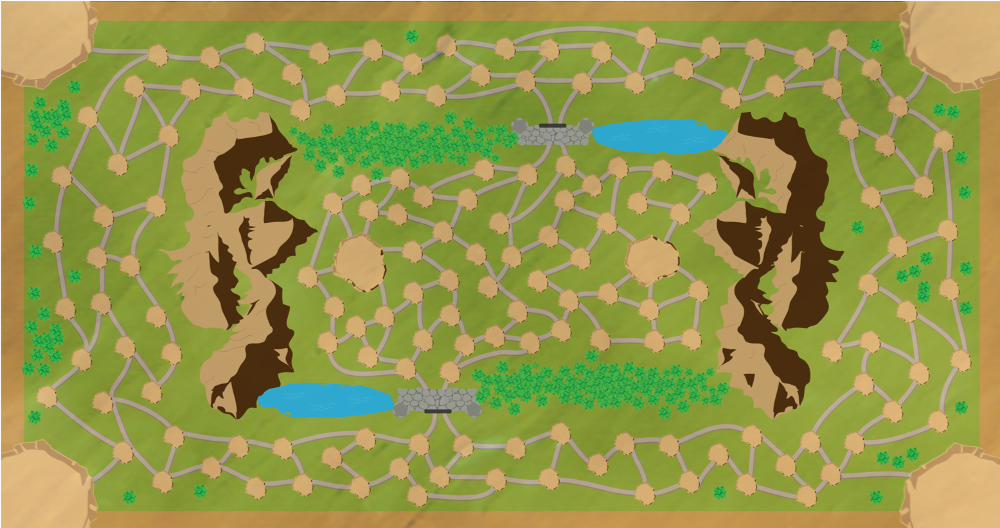

<!-- Global site tag (gtag.js) - Google Analytics -->
<script async src="https://www.googletagmanager.com/gtag/js?id=UA-116712862-1"></script>
<script>
  window.dataLayer = window.dataLayer || [];
  function gtag(){dataLayer.push(arguments);}
  gtag('js', new Date());

  gtag('config', 'UA-116712862-1');
</script>

<center style="font-size:35px">Second Language Teaching and Learning Research
</center>
</br>
```{r, fig.align='center',out.width = "100px",out.height="50px", echo=FALSE}

```

<center style="font-size:30px">Gaming in the Chinese Dual Language Immersion Classroom </center>
</br>
Utah is one of the first states in the U.S. to offer a statewide dual language immersion (DLI) program in public schools. Currently nearly 200 schools offer one of 5 languages (German, Spanish, Portuguese, French, and Chinese). In these programs students spend half of the day learning in English and the other half in the target language. From first to third grade DLI students learn math in the target language and then in fourth to sixth grade they begin learning science and social studies in the target language. 
</br></br>
One issue, particularly with Chinese DLI students (given the difficulty of the text) is developing both literacy skills and content simultaneously. Learners need more instructional time to learn the Chinese text than students of other DLI languages. However, given the time constraints that DLI programs face, finding the extra time is difficult. One solution is to use games to both improve Chinese literacy skills and subject (e.g. math, science) knowledge. In my research I have developed and tested two games in Chinese DLI classrooms and I am currently working on a mod to create support within a commercial-off-the-shelf game as well as provide methods for tracking students in-game play and behavior as a means to assess learning. Below I provide a brief description of past projects and will update this site as new projects arise. 

<p style="font-size:25px">DLI Board Game -- *神秘森林 (Mystery Forest)*</p>
</br>
```{r, fig.align='center',out.width = "400px",out.height="200px",fig.cap="Board Game Cover", echo=FALSE}

```
This board game was designed for second grade Chinese dual language immersion students to help improve both Chinese vocabulary/characater recognition and math skills (addition and subtraction). Up to 8 players can play on one board  (see below). Each players starts at one of the corner pieces and then rolls one dice to determine how spaces they can move. 
</br></br>
```{r, fig.align='center',out.width = "400px",out.height="200px",fig.cap="Board", echo=FALSE}

```
Spread throughout the outer circle of the game, on the tiles, are randomly placed black markers. Each of the black markers represent a baddie (see below). Each of the baddies have a power score (represented by the lightning bolt) and a health score (represented by the heart symbol). Players can choose to fight the baddies by moving their pieces on to a tile with a black marker. 
</br></br>
```{r, fig.align='center',out.width = "400px",out.height="200px",fig.cap="Baddies", echo=FALSE}
knitr::include_graphics("images/baddies.png")
```


<p style="font-size:25px">Interactive Fiction Game -- *Adventure Chinese*</p>

<a href="http://itlstest.usu.edu/">Interactive Fiction Game</a>


</br>
</br>

###Reading in Digital, Collaborative Environments
*Coming Soon*
</br>
</br>

###Using We Chat in the Chinese L2 Classroom
*Coming Soon*
</br>
</br>

###Using E-Gloss Tools to Faciliate Reading in Chinese
*Coming Soon*
</br>
</br>

###Graded Readers for Chinese as a Foreign Language Learners
*Coming Soon*
</br>
</br>

###Teaching Characters with Pinyin
*Coming Soon*
</br>
</br>

<center style="font-size:35px">Computer Science Education Research</center>

</br>
```{r, fig.align='center',out.width = "400px",out.height="20px", echo=FALSE}
knitr::include_graphics("images/Appcamp.png")
```

###Broadening Participation in Computer Science Fields

*Coming Soon*
</br>
</br>

###Student perceptions of Computer Scientists

*Coming Soon*
</br>
</br>
