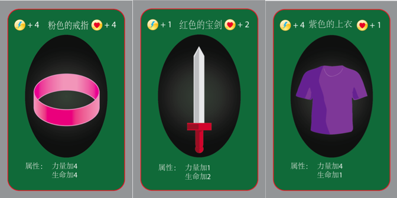
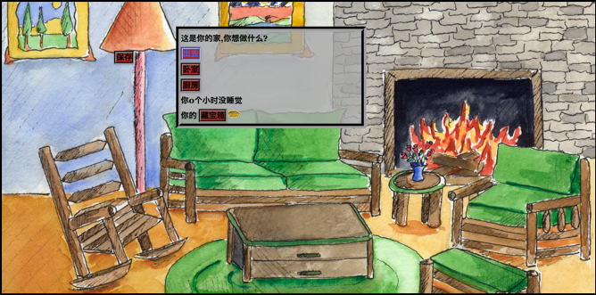
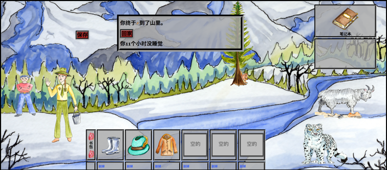

<!-- Global site tag (gtag.js) - Google Analytics -->
<script async src="https://www.googletagmanager.com/gtag/js?id=UA-116712862-1"></script>
<script>
  window.dataLayer = window.dataLayer || [];
  function gtag(){dataLayer.push(arguments);}
  gtag('js', new Date());

  gtag('config', 'UA-116712862-1');
</script>

#Second Language Teaching and Learning Research

</br>
```{r, fig.align='center',out.width = "100px",out.height="50px", echo=FALSE}
knitr::include_graphics("images/researchIcon.png")
```

<hr>
<hr>

##Gaming in the Chinese Dual Language Immersion Classroom

</br>
Utah is one of the first states in the U.S. to offer a statewide dual language immersion (DLI) program in public schools. Currently nearly 200 schools offer one of 5 languages (German, Spanish, Portuguese, French, and Chinese). In these programs students spend half of the day learning in English and the other half in the target language. From first to third grade DLI students learn math in the target language and then in fourth to sixth grade they begin learning science and social studies in the target language. 
</br></br>
One issue, particularly with Chinese DLI students (given the difficulty of the text) is developing both literacy skills and content simultaneously. Learners need more instructional time to learn the Chinese text than students of other DLI languages. However, given the time constraints that DLI programs face, finding the extra time is difficult. One solution is to use games to both improve Chinese literacy skills and subject (e.g. math, science) knowledge. In my research I have developed and tested two games in Chinese DLI classrooms and I am currently working on a mod to create support within a commercial-off-the-shelf game as well as provide methods for tracking students in-game play and behavior as a means to assess learning. Below I provide a brief description of past projects and will update this site as new projects arise. 

###DLI Board Game -- *神秘森林 (Mystery Forest)*

</br>
```{r, fig.align='center',out.width = "400px",out.height="200px",fig.cap="Board Game Cover", echo=FALSE}
knitr::include_graphics("images/mfBoard.png")
```
This board game was designed for second grade Chinese dual language immersion students to help improve both Chinese vocabulary/characater recognition and math skills (addition and subtraction). Up to 8 players can play on one board  (see below). Each players starts at one of the corner pieces and then rolls one dice to determine how spaces they can move. 
</br></br>
```{r, fig.align='center',out.width = "400px",out.height="200px",fig.cap="Board", echo=FALSE}
knitr::include_graphics("images/board.png")
```
Spread throughout the outer circle of the game, on the tiles, are randomly placed black markers. Each of the black markers represent a baddie (see below). Each of the baddies have a power score (represented by a lightning bolt) and a health score (represented by a heart symbol). Players can choose to fight the baddies by moving their pieces on to a tile with a black marker. Battles completed by rolling dice. The power score dictates the number of dice to use and the total number rolled on the dice is the amount subtracted from the health score. After a player attacks the baddie attacks. The game is designed so that players will struggle to bring down a baddie on their own. Players must use Chinese and Math skills to discuss strategies for taking on baddies. 
</br></br>
```{r, fig.align='center',out.width = "400px",out.height="200px",fig.cap="Baddies", echo=FALSE}
knitr::include_graphics("images/baddies.png")
```
Once a baddie is defeated, players are able to draw a set number of items (depending on the baddie) from the Items deck. Items (see below) can be added to a player's character to increase their own health score and power score.
```{r, fig.align='center',out.width = "400px",out.height="200px",fig.cap="Items", echo=FALSE}

```
To keep track of items and player scores, players can use the character sheet (see below).
```{r, fig.align='center',out.width = "400px",out.height="200px",fig.cap="Items", echo=FALSE}
knitr::include_graphics("images/charactersheet.png")
```
The game ends once players have defeated all baddies on the board. However, the game can continue on by adding more baddies each during each subsequent session. 

####Findings 
This study was not published as I am currently working on revising the game. In the initial round some groups played the game successfully and engaged in meaningful addition/subtraction in the target language, however other groups struggled with using the character sheet and the many pieces on the board ended up being a distraction. At the moment I am working on turning it into a card game which will eliminate many of the distractions and allow learners to spend more time on the collaborative and educational aspects of the game. 

###Interactive Fiction Game -- *Adventure Chinese*

Following the board game I developed an HTML based interactive fiction game using <a href="twinery.org">Twine</a>. In the game players are sent on an adventure to stop a villian from world domination by collecting three keys in the wilderness and opening a chest to retreive a magic seed.
</br></br>
In the game players start in their home where they can collect items that may or may not be useful on their adventure. One of the items they can collect is a notebook which allows them to look up vocabulary words as they read their stories. However, they can only have ten words in their notebook at one time, so they will be constantly pushed to evauluate their current understanding of the vocabulary in their notebook.
```{r, fig.align='center',out.width = "400px",out.height="200px",fig.cap="Items", echo=FALSE}

```
As players travel into the wilderness they come upon animals, people and other things in nature. Depending on the choices they make in each scenario their chances of finding one of the keys increasess or decreases.
```{r, fig.align='center',out.width = "400px",out.height="200px",fig.cap="Items", echo=FALSE}

```
Once all three keys have been found the game is complete. The article below has more details concerning the findings in this project. 

**Poole, F.**, Franco, J., & Clarke-Midura, J. Developing a personalized, educational gaming experience for young Chinese DLI learners: A design-based approach. In R. Zheng (Ed.), *Digital Technologies and Instructional Design for Personalized Learning* (pp. 253-274). IGI Global
</br>
</br>
Click the link below to try the game. *For best results open the game using FireFox Web Browser*
</br>
</br>
<a href="http://itlstest.usu.edu/">Adventure Chinese Game</a>
</br>
</br>

##Reading in Digital, Collaborative Environments
In the last few years I have collaborated with <a href="https://lpcs.usu.edu/directory/faculty/thoms-joshua">Dr. Joshua Thoms</a> and <a href="https://lpcs.usu.edu/directory/faculty/sung-ko-yin">Dr. Ko-Yin Sung</a>, to explore the affordances and pedagogical implications of reading in a digital, collaborative environment. 

In our first project we used eComma in a first-year Chinese course. See the article below for more information. 
</br>
2017 --	Thoms, J., Sung, K. Y., & **Poole, F.** Investigating the linguistic and pedagogical affordances of an L2 open reading environment via eComma: An exploratory study in a Chinese language course.
</br>
</br>
```{r, fig.align='center',out.width = "400px",out.height="200px",fig.cap="eComma Environment", echo=FALSE}
knitr::include_graphics("images/eComma.png")
```
</br>
</br>
Dr. Joshua Thoms and I have conducted some additional studies using the Hylighter Environment with an Advanced Spanish Poetry class. See the articles below for more information. 
</br>
</br>
Forthcoming -- Thoms, J., & **Poole, F.** Exploring digital literacy practices via L2 social reading, *L2 Journal* (Special Issue).
</br>
</br>
Thoms, J., & **Poole, F.** Investigating linguistic, literary, and social affordances of L2 collaborative reading. *Language Learning & Technology*, 21(2), 139–156.
</br>
</br>
```{r, fig.align='center',out.width = "400px",out.height="200px",fig.cap="Hylighter Environment", echo=FALSE}
knitr::include_graphics("images/hylighter.png")
```

</br>
</br>

##Using We Chat in the Chinese L2 Classroom


</br>
</br>

##Using E-Gloss Tools to Faciliate Reading in Chinese
*Coming Soon*
</br>
</br>

##Graded Readers for Chinese as a Foreign Language Learners
*Coming Soon*
</br>
</br>

##Teaching Characters with Pinyin
*Coming Soon*
</br>
</br>

<hr>
<hr>

#Computer Science Education Research

</br>
```{r, fig.align='center',out.width = "400px",out.height="20px", echo=FALSE}
knitr::include_graphics("images/Appcamp.png")
```

<hr>
<hr>

##Broadening Participation in Computer Science Fields

*Coming Soon*
</br>
</br>

##Student perceptions of Computer Scientists

*Coming Soon*
</br>
</br>
<hr>
<hr>