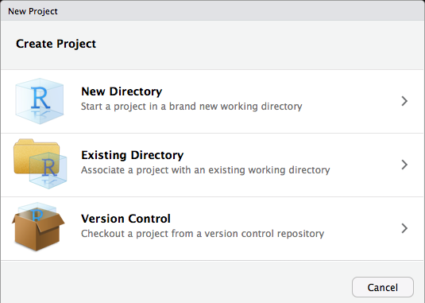

<!-- Global site tag (gtag.js) - Google Analytics -->
<script async src="https://www.googletagmanager.com/gtag/js?id=UA-116712862-1"></script>
<script>
  window.dataLayer = window.dataLayer || [];
  function gtag(){dataLayer.push(arguments);}
  gtag('js', new Date());

  gtag('config', 'UA-116712862-1');
</script>
<center  style="font-size:40px">R Projects</center>


```{r, fig.align='center',out.width = "100px",out.height="50px", echo=FALSE}
knitr::include_graphics("images/Ricon.png")
```

On this page you'll find a brief introduction to R as well as some examples of the analysis that I have run using R in the last few years. 

For the Analysis below I will be using the EGloss data set. This data was collected in 2014 and compares vocabulary learning by second language learners of Chinese when reading via traditional format and a gloss (http://www.mandarintools.com/dimsum.html). Below is a list of the variables in the data set. 
</br>
</br>
<ul>
<li>**ID** -- This is the unique ID for each student in the data set </li>
<li>**Week** -- This is the week in which the student did the reading. Students read one reading per week for ten weeks. The first two weeks were used a trial run and thus were not included in this data set. </li>
<li>**VocabWords** -- Each week the length of reading varied slightly, so this variable counts the number of words in the text read to control for text lenght.</li>
<li> **Course** -- There were two courses, year one (1020) and year two (2020) Chinese. </li>
<li> **Pre_Sum** -- This is the total correct score on the pre-vocabuly test. All words have two possible points, one for pinyin and one for the English. </li>
<li> **Post_Sum** -- This is the total correct score on the post-vocabuly test. All words have two possible points, one for pinyin and one for the English.</li>
<li> **RawGain** -- This is the gain score that was calculated by subtracting the pre-test scores from the post-test scores.</li>
<li> **Per_Pre** -- Because each week had a different number of vocabulary words, this is the percentage of correct vocabulary on the pre-test.</li>
<li> **Per_Post** --Because each week had a different number of vocabulary words, this is the percentage of correct vocabulary on the post-test.</li>
<li> **Per_Gain** -- This is the percentage of vocabulary gained after each reading each week. </li>
</ul>

For more information about this data set please see the following article:
2016 --	**Poole, F.**, & Sung, K. A preliminary study on the effects of an E-gloss tool on incidental vocabulary learning when reading Chinese as a foreign language. *Journal of Chinese Language Teachers Association*. 51(3), 266–285.

```{r echo=FALSE, warning=FALSE}
library(readxl)
gloss <- read_excel("eGlossData.xlsx", 
    col_types = c("text", "numeric", "text", 
        "numeric", "numeric", "numeric", 
        "numeric", "numeric", "numeric", 
        "numeric", "numeric"))
head(gloss,n=15)
```

#Download R and Rstudio
1.<a href="https://www.r-project.org/" class="button">Download R</a>
</br>
</br>
2.<a href="https://www.rstudio.com/ " class="button">Download R Studio</a>

#Create a Project
Once you have downloaded R and Rstudio. You should begin by creating a new project in RStudio. You could just simply open R studio and start coding in the console, or create a new script and start coding in the script, but creating a new Project for each data analysis project that you do will save trouble further down the road. 

To start a new project open Rstudio, click File, New Project. The image below should pop up and prompt you to create a new directory or to use an existing directory. I usually just create an empty folder somewhere on my computer and then use select an existing directory. 

```{r, fig.align='center',out.width = "300px",out.height="300px", echo=FALSE}

```

Once you have created a new project you should see a .Rproj file in the folder that you created. In this same folder you will want to drag in whatever data file you are currently using (.csv, .spss, .xsls are all suitable among others). By creating a project and adding your data file to the folder you will a) save yourself time when importing the file into your project because you won't have to add a long path file to your code, and b) you will make your life easier when you have to return to your analysis five months after you already completed it. More on this later. 

#Loading Data
When loading data into R you will often need to use a package for files other than .csv. If you have not already installed a package into your R environment, you'll need to run the following code in the console: `install.packages("PackageName")` **(Don't forget to add the parentheses when installing a package...loading a library does not use parentheses)**. After you have installed it once, you can simply recall the package by running `library(PackageName)`. Below are list of the packages that are needed for each file type. 

**.csv files** -- `No Package Needed` -- `df <- read.table("eGloss.csv", header=TRUE, sep=",")`
</br>
**.xlsx files** -- `library(readxl)` -- `df <- read_excel("eGlossData.xlsx")`
</br>
**.spss files** -- `library(haven)` -- `df <- read_sav(eGlossData.spss)`
</br>
**.sas files** -- `library(haven)` -- `df <- read_sas(eGlossData.sas)`
</br>

For this project I'll be uploading the following excel file. *Remember if you create a project and add the file to the same folder as your project, you don't need to worry about specifying the path ofthe file.*

The code `col_types` identifies the type of variable that each column is. So column one is a text variable, two is a numeric and so on.
```{r echo=FALSE, warning=FALSE}
library(readxl)
gloss <- read_excel("eGlossData.xlsx", 
    col_types = c("text", "numeric", "text", 
        "numeric", "numeric", "numeric", 
        "numeric", "numeric", "numeric", 
        "numeric", "numeric"))
head(gloss,n=15)
```
</br>
</br>

##Renaming your Data
Now that I have my data uploaded, I need to rename it. Renamining your data to something simple and generic can be very useful in R. First, if you keep the name `eGlossData`, then everytime you want to run an analysis or use a variable from this data set you'll need to either use `attach()` and `detach()` functions, or you'll need to type out the entire name. It doesn't seem like a long name now, but after you type it out 100 times, you'll wish you had a smaller name. Secondly, if you use a generic name like `df` (data frame) and if you save your code into a script within your project, then the next time you want to run your script with say another data set, you'll just need to rename your new data set to `df` and then all of your code should run smoothly... provided that the data is in a similar format. 

Renaming data sets in R is pretty simple. See code below. 

```{r}
df <- gloss
```
Voilà, my data set is now called `df`. 
</br>
<hr>
<hr>

#Transorming Data

</br>
</br>

##Creating New Variables
In the this data set we already have a variable called "RawGain." But to practice we are going to create another variable simply called gain to show a) how to create new variables and b) how to do simple arithmetic in R. 

To create a new variable simple use the `$` after your data set, and then type in a variable that is not currently in your data set. Then use the arror `<-` to define what will be stored in the variable. See example below.
```{r}
df$gain <- df$Post_Sum - df$Pre_Sum
```
To check our answer we will look at the first 15 cases of each variable using the `head` command.

```{r}
head(df$RawGain, n=15)
```

```{r}
head(df$gain, n=15)
```
</br>
</br>

##Impute Missing Data

```{r}
#Coming soon

```
</br>
</br>

##Renaming your Variables
You may want to rename your variables for a variety of reasons. You could simply change the name in your excel file, but if you'd like to do it in R you can use the following code. For this example, I will use the *gain* variable that we made a copy of earlier. I want to make sure that it is known that this variable is just a test variable, so I will change the name to *gain_test*

```{r}
colnames(df)[colnames(df)=="gain"] <- "gain_test"

```
</br>
</br>

##Complete Cases
For some analysis you'll need to remove any missing variables. The easiest way to do this is to use the filter function in the `library(dplyr)`. 

For this data set, I do not have any missing cases, but I will run it anyway. Notice that I add an _c to the data set. Whenever removing multiple cases I like to save it into another object and then run `nrow(df_c)` to get the number of cases in my new data set.

```{r}
library(dplyr)
df_c <-  df %>% filter(complete.cases(.)) 
nrow(df) #this is quick way to see how many cases you have in each data set
nrow(df_c) #notice they are the same, that's because we don't have any missing data sets. 
```
</br>
</br>

##Changing Variable Types (e.g. numeric, factor)
Often times when you import your data set into R using excel or csv your variables will be loaded as incorrect data types. For exmample if you coded Gender as 1=Female, and 2=Male, your gender variable will be saved as a numeric variable, when it should probably be a factor. That being said, if you want to use gender in a correlation matrix you'll need to convert it back to a numeric variable. The easiest way to see how your variables are being stored is to use `str(df)`. Currently, my variables *ID* and *Format* are being stored as characters. For most analyses this is ok. But for this tutorial I will change them into Factors. My *Course* variable is also being stored as a numeric, when this should really be a factor. There are two ways to do this, first I will demonstrate how to do each individual variable, then I'll show a way to do multiple variables. 

```{r}
str(df)

df$ID <-as.factor(df$ID) #In this example, I am saving ID as a factor back into the ID variable. I can change factor to numeric to change it into a different type. 

#Instead of doing each variable one by one, I can save all of the variables I want to change into a cols object, and then change all of them at once using the lapply function.
cols <- c("ID", "Format", "Course")
df[cols] <- lapply(df[cols], factor) #Change factor to numeric if you want numeric variables. 

#Run str() function once more to check that my variables have changed.
str(df)
```
</br>
</br>

##Subsetting Data
There are many reasons to subset your data. Subsetting your data simply means that you create a separate data set with only a subset of your variables. You may want to do this to create a correlation matrix with a specific set of variables. You may also want to do this to create a data set of only females or males. In this case of this data set, I will create two subsetted (I don't think that's a word... but let's run with it) datasets one for a correlation matrix using only *Per_Pre*, *Per_Post* and *Week* to see if pre and post scores correlate with time in the study. I will also create a separate data set for each *Course* in the data set to do separate analyses. 

```{r}
#Note for each new subset I create a new object that identifies my new dataset. 

df_cor <- subset(df, select= c("Per_Pre","Per_Post","Week")) #Here I am telling R to create a new data set with the three variables selected. 

df_1020 <- subset(df, Course=="1020") #Here I am saying to create a new data set of all cases in which Course = 1020
df_2020 <- subset(df, Course=="2020")

```
</br>
</br>

##Transform Wide to Long
*Coming Soon*
```{r}

```

</br>
<hr>
<hr>

#Running Descriptives
*Coming Soon*
</br>
</br>

##Base Descriptive Packages
*Coming Soon*
```{r}

```
</br>
</br>

##Using Tapply and Sapply to get specific descriptives
*Coming Soon*
```{r}

```
</br>
</br>

##Displaying Descriptives
*Coming Soon*
```{r}

```
</br>
</br>

##Printing Descriptives and Saving Files
*Coming Soon*
```{r}

```

</br>
<hr>
<hr>

#Simple Parametric Tests

```{r}

```
</br>
</br>

##T-Tests
*Coming Soon*
```{r}

```
</br>
</br>

##ANOVA
*Coming Soon*
```{r}

```
</br>
</br>

##Chi-Square Tests
*Coming Soon*
```{r}

```
</br>
</br>

##Regressions
*Coming Soon*
```{r}

```
</br>
</br>

##Effect Size
*Coming Soon*
</br>
</br>
<hr>
<hr>

#Simple Non-Parametric Tests

</br>
</br>

##Wilcoxon-Signed Rank Test
*Coming Soon*
```{r}

```
</br>
</br>
<hr>
<hr>

#Basic Graphs

</br>
</br>

##Bar Graphs
*Coming Soon*
```{r}

```

</br>
</br>

##Box Plots
*Coming Soon*
```{r}

```

</br>
</br>

##Linear Plots
*Coming Soon*
```{r}

```

</br>
</br>

##Customizing Basic Plots
*Coming Soon*
```{r}

```

</br>
<hr>
<hr>

#GGPLOT Graphs

```{r}

```

</br>
<hr>
<hr>

#Multivariate Analysis
</br>
</br>

##Path Models
*Coming Soon*
```{r}

```
</br>
</br>

##Cluster Analysis
*Coming Soon*
```{r}

```
</br>
</br>

##CART Analysis
*Coming Soon*
```{r}

```
</br>
<hr>
<hr>

